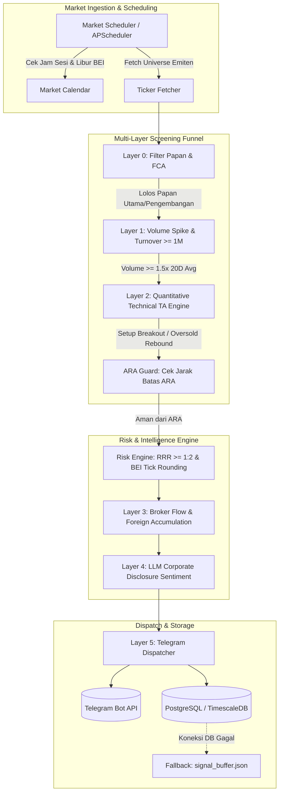

# IDX Stock Radar (AI Automation Bot)

Platform automasi analitik berbasis server yang memantau pergerakan seluruh emiten di Bursa Efek Indonesia (BEI / IDX) secara otonom. Menggabungkan *quantitative technical screening*, analisis likuiditas & mikrostruktur (*broker flow* / bandarmologi), mitigasi risiko terintegrasi dengan fraksi harga resmi BEI, serta inferensi *Large Language Model* (LLM) terhadap aksi korporasi dan keterbukaan informasi emiten.

---

## Daftar Isi

1. [Arsitektur Sistem](#arsitektur-sistem)
2. [Alur Pipeline Penyaringan (Multi-Layer Funnel)](#alur-pipeline-penyaringan-multi-layer-funnel)
3. [Fitur Utama](#fitur-utama)
4. [Tumpukan Teknologi (Tech Stack)](#tumpukan-teknologi-tech-stack)
5. [Struktur Direktori Proyek](#struktur-direktori-proyek)
6. [Kepatuhan Regulasi BEI](#kepatuhan-regulasi-bei)
   - [Fraksi Harga (Tick Size)](#fraksi-harga-tick-size)
   - [Auto Rejection Simetris & ARA Guard](#auto-rejection-simetris--ara-guard)
   - [Kalender & Jam Sesi Perdagangan](#kalender--jam-sesi-perdagangan)
7. [Panduan Instalasi & Konfigurasi](#panduan-instalasi--konfigurasi)
   - [Prasyarat](#prasyarat)
   - [Setup Virtual Environment](#setup-virtual-environment)
   - [Konfigurasi Variabel Lingkungan (.env)](#konfigurasi-variabel-lingkungan-env)
8. [Cara Menjalankan Sistem](#cara-menjalankan-sistem)
   - [Eksekusi Lokal (Python CLI)](#eksekusi-lokal-python-cli)
   - [Eksekusi Containerized (Docker Compose)](#eksekusi-containerized-docker-compose)
9. [Format Sinyal & Notifikasi Telegram](#format-sinyal--notifikasi-telegram)
10. [Skema Basis Data](#skema-basis-data)
11. [Pengujian (Testing)](#pengujian-testing)
12. [Penafian Resmi (OJK Disclaimer)](#penafian-resmi-ojk-disclaimer)

---

## Arsitektur Sistem



---

## Alur Pipeline Penyaringan (Multi-Layer Funnel)

Setiap siklus pemindaian mengevaluasi emiten melalui filter berjenjang berurutan (*fail-fast pipeline*):

1. **Layer 0 (Eligibility Filter)**: Mengeliminasi saham yang masuk ke dalam Papan Pemantauan Khusus (FCA), emiten bertato notasi khusus suspensi, dan membatasi hanya pada papan utama/pengembangan.
2. **Layer 1 (Volume & Turnover Filter)**: Mengharuskan volume intraday mencapai ambang batas lonjakan (default: $\ge 1.5\times$ rata-rata volume 20 hari) dengan nilai transaksi harian kumulatif $\ge \text{Rp1.000.000.000}$.
3. **Layer 2 (Technical Indicators)**: Menghitung SMA (20, 50, 200), RSI (14), dan ATR (14). Memvalidasi sinyal penembusan (*breakout*) atau pembalikan arah dari area jenuh jual (*oversold bounce*).
4. **Safety Guard (ARA Proximity)**: Memeriksa kedekatan harga pasar saat ini terhadap batas *Auto Rejection Atas* (ARA). Sinyal dibatalkan jika harga berada dalam batas toleransi $\le 1.5\%$ atau $\le 2$ *tick* dari batas ARA untuk menghindari order macet.
5. **Risk Engine**: Membangun *Trading Plan* terstruktur (Entry, Stop Loss $\le 1.5\times \text{ATR}$, Target Profit 1 & 2) dengan syarat *Risk-to-Reward Ratio* (RRR) minimal $1:2$. Seluruh level harga dibulatkan otomatis ke kelipatan fraksi harga (*tick size*) resmi BEI.
6. **Layer 3 (Broker Flow / Bandarmologi)**: Menganalisis rasio akumulasi/distribusi net broker Top-3 serta arah aliran dana asing (*Foreign Flow*).
7. **Layer 4 (AI Sentiment Engine)**: Mengambil keterbukaan informasi emiten terbaru dan melakukan inferensi klasifikasi sentimen serta ekstraksi katalis menggunakan LLM (OpenRouter / OpenAI / Anthropic).
8. **Layer 5 (Notifier & Database Persister)**: Menyiapkan *payload* terformat Markdown, mengirimkan notifikasi ke Telegram, dan mencatat log sinyal ke PostgreSQL/TimescaleDB (dengan *fallback flat-file buffer* jika database tidak aktif).

---

## Fitur Utama

- **Autonomous Market Scheduling**: Beroperasi otomatis pada jam bursa (Sesi I & Sesi II) dan mengabaikan hari libur bursa BEI via modul `MarketCalendar`.
- **BEI Tick Size Conformity**: Algoritma pembulatan presisi mengikuti 5 kelompok fraksi harga regulasi bursa.
- **Symmetric ARA/ARB Engine**: Kalkulasi batas fluktuasi harga harian BEI (35%, 25%, 20%) dinamis.
- **Bandarmologi Metric**: Deteksi akumulasi broker Top-3 (Big Accumulation, Small Accumulation, Neutral, Distribution).
- **Fault-Tolerant Resilience**:
  - Jeda eksponensial (*exponential backoff retry*) pada pemanggilan API eksternal.
  - Sinyal darurat tetap disalurkan ke Telegram dan dicadangkan ke `signal_buffer.json` saat database *down*.
  - Pemotongan token teks berita ($\le 500$ kata) dan batas waktu timeout LLM ($\le 10$ detik) untuk menjaga kecepatan pipeline $\le 30$ detik.

---

## Tumpukan Teknologi (Tech Stack)

| Komponen | Teknologi | Deskripsi |
| :--- | :--- | :--- |
| **Runtime & Core** | Python 3.11+ / 3.12 | Komputasi kuantitatif dan manajemen proses otonom |
| **Data Processing** | Pandas, NumPy | Kalkulasi deret waktu dan analisis teknikal |
| **Data Ingestion** | yfinance, Requests, BeautifulSoup4 | Pengambilan data harga pasar dan keterbukaan informasi |
| **Scheduling** | APScheduler, Holidays | Penjadwalan interval pasar & kalender libur bursa Indonesia |
| **Model AI Kualitatif**| OpenAI, Anthropic, OpenRouter API | Inferensi klasifikasi sentimen keterbukaan informasi |
| **Data Validation** | Pydantic v2 | Skema kontrak data sinyal dan konfigurasi |
| **Database** | PostgreSQL 16 / TimescaleDB | Penyimpanan hypertable time-series dan riwayat log sinyal |
| **Database Driver** | psycopg2-binary, asyncpg | Driver koneksi relasional database |
| **Notifikasi** | Telegram Bot API | Notifikasi real-time via HTTP dispatcher |
| **Containerization** | Docker, Docker Compose | Deployment terisolasi multi-container |

---

## Struktur Direktori Proyek

```text
idx-stock-radar/
├── analyzer/                 # Analisis sentimen berita & keterbukaan informasi emiten
│   ├── __init__.py
│   └── sentiment.py          # LLMSentimentAnalyzer (OpenRouter, OpenAI, Anthropic)
├── fetcher/                  # Komponen penarik data pasar & informasi eksternal
│   ├── __init__.py
│   ├── broker_flow.py        # BrokerFlowFetcher (Bandarmologi & Foreign Flow)
│   ├── disclosure.py         # DisclosureFetcher (Ekstraksi keterbukaan informasi BEI)
│   ├── market_data.py        # MarketDataFetcher (Snapshot harga & volume via yfinance)
│   └── ticker_list.py        # TickerListFetcher (Filter master emiten & papan BEI)
├── models/                   # Definisi model data terstruktur (Pydantic v2)
│   ├── __init__.py
│   ├── sentiment.py          # SentimentAnalysisResult
│   ├── signal.py             # SignalPayload, TradingPlan, SignalMetrics
│   └── ticker.py             # Ticker & Board classification
├── notifier/                 # Sistem formatting dan pengiriman peringatan
│   ├── __init__.py
│   ├── formatter.py          # Template Markdown sinyal Telegram
│   └── telegram.py           # TelegramNotifier HTTP dispatcher
├── risk_engine/              # Mesin kalkulasi risiko & aturan bursa
│   ├── __init__.py
│   ├── tick_size.py          # Fraksi harga resmi BEI & logika ARA/ARB
│   └── trading_plan.py       # Kalkulator Entry, Stop Loss, Target Profit, dan RRR
├── screener/                 # Mesin penyaringan kuantitatif bertingkat
│   ├── __init__.py
│   ├── broker_analysis.py    # Klasifikasi volume Top-3 broker
│   ├── eligibility.py        # Validasi status emiten (FCA, Suspensi, Papan)
│   ├── technical.py          # Kalkulasi indikator teknikal (SMA, RSI, ATR)
│   └── volume_spike.py       # Pengecekan lonjakan volume vs rata-rata 20 hari
├── tests/                    # Test suite terotomatisasi (Pytest)
│   ├── test_fixes.py
│   ├── test_market_calendar.py
│   ├── test_notifier.py
│   ├── test_risk_engine.py
│   ├── test_screener.py
│   └── test_tick_size.py
├── utils/                    # Utilitas pendukung
│   ├── __init__.py
│   ├── logger.py             # Structured logging console/file
│   ├── market_calendar.py    # Jam operasional pasar & penanganan libur BEI
│   └── retry.py              # Dekorator retry dengan exponential backoff
├── .env.example              # Template variabel lingkungan
├── config.py                 # Konfigurasi aplikasi tersentralisasi
├── db.py                     # DatabaseManager (PostgreSQL / TimescaleDB & Buffer)
├── DOCS.md                   # Dokumen spesifikasi teknis (PRD, SRS, Technical Specs)
├── Dockerfile                # Multi-stage image build Python 3.12-slim
├── docker-compose.yml        # Orchestration PostgreSQL/TimescaleDB & Scanner Engine
├── pytest.ini                # Konfigurasi pengujian pytest
├── requirements.txt          # Daftar dependensi modul Python
├── scheduler.py              # Entry point utama aplikasi & loop penjadwalan pasar
└── signal_buffer.json        # Flat-file backup penampung sinyal saat DB offline
```

---

## Kepatuhan Regulasi BEI

### Fraksi Harga (Tick Size)

Sistem memastikan harga Entry, Stop Loss, dan Take Profit selalu valid pada antrean *orderbook* BEI:

| Rentang Harga Saham | Fraksi Harga (*Tick*) | Perubahan Maksimal Per *Tick* |
| :--- | :--- | :--- |
| $< \text{Rp200}$ | $\text{Rp1}$ | $\text{Rp10}$ |
| $\text{Rp200} - \text{Rp500}$ | $\text{Rp2}$ | $\text{Rp20}$ |
| $\text{Rp500} - \text{Rp2.000}$ | $\text{Rp5}$ | $\text{Rp50}$ |
| $\text{Rp2.000} - \text{Rp5.000}$ | $\text{Rp10}$ | $\text{Rp100}$ |
| $\ge \text{Rp5.000}$ | $\text{Rp25}$ | $\text{Rp250}$ |

### Auto Rejection Simetris & ARA Guard

Batasan fluktuasi harga harian yang diterapkan sistem:

| Rentang Harga Saham | Persentase ARA / ARB |
| :--- | :--- |
| $\text{Rp50} - \text{Rp200}$ | $\pm 35\%$ |
| $> \text{Rp200} - \text{Rp5.000}$ | $\pm 25\%$ |
| $> \text{Rp5.000}$ | $\pm 20\%$ |

> **Kriteria Pembatalan Sinyal (ARA Proximity Guard):**  
> Jika $\text{current\_price} \ge (\text{ara\_limit} - (2 \times \text{tick\_size}))$ atau berada $\le 1.5\%$ dari batas ARA, sinyal otomatis digugurkan demi memitigasi risiko order gagal akibat antrean batas atas.

### Kalender & Jam Sesi Perdagangan

Sistem hanya menjalankan siklus pemindaian pada hari bursa aktif:
- **Sesi I:** 09.00 – 12.00 WIB (Senin – Jumat)
- **Sesi II:** 13.30 – 16.00 WIB (Senin – Jumat)
- **Hari Libur:** Menggunakan deteksi otomatis kalender hari libur nasional Indonesia via library `holidays`.

---

## Panduan Instalasi & Konfigurasi

### Prasyarat

- Python 3.11 atau lebih baru
- Git
- Docker & Docker Compose *(opsional, untuk setup basis data TimescaleDB terisolasi)*

### Setup Virtual Environment

```bash
# Clone repositori
git clone <repository-url>
cd idx-stock-radar

# Buat virtual environment
python -m venv .venv

# Aktivasi virtual environment (Windows PowerShell)
.venv\Scripts\Activate.ps1

# Aktivasi virtual environment (Linux / macOS)
source .venv/bin/activate

# Instalasi dependensi
pip install -r requirements.txt
```

### Konfigurasi Variabel Lingkungan (.env)

Salin berkas `.env.example` menjadi `.env` dan lengkapi kredensial yang dibutuhkan:

```bash
cp .env.example .env
```

Deskripsi parameter utama dalam `.env`:

```ini
# Notifikasi Telegram
TELEGRAM_BOT_TOKEN=123456789:ABCdefGhIJKlmNoPQRsTUVwxyZ
TELEGRAM_CHAT_ID=-1001234567890

# Provider LLM ("openrouter", "openai", "anthropic")
LLM_PROVIDER=openrouter
OPENROUTER_API_KEY=sk-or-v1-xxxxxxxxxxxxxxxxxxxx
LLM_MODEL=nvidia/nemotron-3-super-120b-a12b:free
LLM_TIMEOUT_SECONDS=10
LLM_MAX_WORDS=500

# Basis Data (PostgreSQL / TimescaleDB)
DB_HOST=localhost
DB_PORT=5432
DB_NAME=idx_market_db
DB_USER=postgres
DB_PASSWORD=idxpassword

# Parameter Filter Kuantitatif
MIN_TURNOVER=1000000000          # Minimal omzet Rp1 Miliar
VOLUME_SPIKE_THRESHOLD=1.5       # Lonjakan 1.5x rata-rata 20 hari
VOLUME_AVG_DAYS=20
RSI_PERIOD=14
ATR_PERIOD=14

# Manajemen Risiko
ATR_SL_MULTIPLIER=1.5            # Toleransi Stop Loss maksimal 1.5x ATR
MIN_RRR=2.0                      # Risk-to-Reward minimal 1:2
ARA_BUFFER_PERCENT=1.5
ARA_BUFFER_TICKS=2

# Penjadwal Pasar
SCAN_INTERVAL_MINUTES=15         # Interval pemindaian berkala (menit)
TZ=Asia/Jakarta
TICKER_BOARDS=UTAMA,PENGEMBANGAN # Papan emiten yang diizinkan
```

---

## Cara Menjalankan Sistem

### Eksekusi Lokal (Python CLI)

#### 1. Uji Coba Sekali Jalan (Bypass Jam Bursa untuk Testing)
Gunakan flag `--run-once` untuk memicu 1 siklus pemindaian pasar secara instan tanpa menunggu jam buka bursa:

```bash
python scheduler.py --run-once
```

#### 2. Menjalankan Service Scheduler Otonom
Menjalankan loop penjadwalan latar belakang (*blocking scheduler*) yang aktif sesuai interval pasar:

```bash
python scheduler.py
```

### Eksekusi Containerized (Docker Compose)

Mengaktifkan seluruh ekosistem (TimescaleDB hypertable dan bot pemindai) dalam container Docker:

```bash
# Membangun image dan menjalankan container di background
docker compose up -d

# Memeriksa log aktivitas container
docker compose logs -f scanner_service

# Menghentikan layanan
docker compose down
```

---

## Format Sinyal & Notifikasi Telegram

Sinyal yang lolos seluruh tahapan validasi dikirimkan ke Telegram dengan format Markdown terstruktur:

```markdown
🚨 IDX STOCK RADAR - NEW SIGNAL 🚨

Ticker: BBRI (Bank Rakyat Indonesia (Persero) Tbk.)
Setup Type: PULLBACK_REBOUND

📈 TRADING PLAN
• Entry Price: Rp4,950
• Stop Loss: Rp4,800
• Take Profit 1: Rp5,250
• Take Profit 2: Rp5,450
• Risk-to-Reward Ratio (RRR): 1:2.0

📊 METRICS & ANALYSIS
• RSI (14): 41.2
• Volume Multiplier: 2.30x (vs Rata-rata 20 Hari)
• Foreign Flow: HIGH
• Broker Flow (Bandarmologi): BIG_ACCUM

🤖 AI SENTIMENT CONTEXT
"Kinerja pertumbuhan kredit mikro stabil di atas rata-rata industri dengan rasio NPL terkendali."

⚠️ DISCLAIMER ON
Analisis ini digenerasi secara otonom oleh bot komputasi untuk tujuan riset dan pencatatan pribadi. Bukan merupakan nasihat keuangan atau ajakan jual-beli efek sebagaimana diatur dalam regulasi OJK. Risiko investasi ditanggung sepenuhnya oleh masing-masing pelaku pasar.
```

---

## Skema Basis Data

Sistem menggunakan PostgreSQL 16 (TimescaleDB) untuk mengarsipkan riwayat harga dan log sinyal:

```sql
-- 1. Master Ticker Universe
CREATE TABLE IF NOT EXISTS master_tickers (
    symbol VARCHAR(10) PRIMARY KEY,
    company_name VARCHAR(255) NOT NULL,
    board VARCHAR(50) NOT NULL,
    is_active BOOLEAN DEFAULT TRUE,
    last_updated TIMESTAMPTZ DEFAULT CURRENT_TIMESTAMP
);

-- 2. Time-Series Hypertable Harga Saham
CREATE TABLE IF NOT EXISTS market_data (
    time TIMESTAMPTZ NOT NULL,
    symbol VARCHAR(10) REFERENCES master_tickers(symbol),
    open NUMERIC(10, 2) NOT NULL,
    high NUMERIC(10, 2) NOT NULL,
    low NUMERIC(10, 2) NOT NULL,
    close NUMERIC(10, 2) NOT NULL,
    volume BIGINT NOT NULL,
    turnover NUMERIC(18, 2) NOT NULL,
    PRIMARY KEY (time, symbol)
);
SELECT create_hypertable('market_data', 'time', if_not_exists => TRUE);

-- 3. Audit Log Eksekusi Sinyal
CREATE TABLE IF NOT EXISTS signal_logs (
    id UUID PRIMARY KEY,
    created_at TIMESTAMPTZ DEFAULT CURRENT_TIMESTAMP,
    symbol VARCHAR(10),
    entry_price NUMERIC(10, 2) NOT NULL,
    stop_loss NUMERIC(10, 2) NOT NULL,
    take_profit_1 NUMERIC(10, 2) NOT NULL,
    take_profit_2 NUMERIC(10, 2) NOT NULL,
    risk_reward_ratio NUMERIC(4, 2) NOT NULL,
    volume_ratio NUMERIC(4, 2) NOT NULL,
    sentiment_score NUMERIC(3, 2),
    sentiment_summary TEXT,
    execution_status VARCHAR(20) DEFAULT 'SENT'
);
```

---

## Pengujian (Testing)

Proyek ini dilengkapi pengujian unit terotomatisasi mencakup modul *risk engine*, fraksi harga, validasi filter kuantitatif, formatting notifikasi, dan kalender perdagangan:

```bash
# Menjalankan seluruh test suite
pytest

# Menjalankan test dengan output detail
pytest -v
```

Cakupan pengujian utama:
- `tests/test_tick_size.py`: Validasi pembulatan 5 rentang fraksi harga resmi BEI dan kalkulasi ambang ARA/ARB.
- `tests/test_risk_engine.py`: Validasi perhitungan target Stop Loss, Take Profit 1 & 2, serta batasan RRR minimal 1:2.
- `tests/test_screener.py`: Validasi filter kelayakan emiten (FCA, notasi suspensi), ambang batas omzet transaksi, dan lonjakan volume.
- `tests/test_market_calendar.py`: Validasi penanganan sesi pasar I/II dan integrasi hari libur nasional.
- `tests/test_notifier.py`: Validasi formatting pesan sinyal Telegram dan kelengkapan penafian regulasi OJK.
- `tests/test_fixes.py`: Validasi penanganan skenario edge case, batas nilai, dan resiliensi pipeline.

---

## Penafian Resmi (OJK Disclaimer)

> **⚠️ DISCLAIMER ON**  
> *Analisis dan sinyal perdagangan yang dihasilkan oleh sistem ini diproses secara otonom oleh algoritma komputasi untuk tujuan riset, edukasi, dan pencatatan pribadi. Sistem ini BUKAN merupakan penasihat investasi berlisensi dan BUKAN merupakan ajakan atau rekomendasi resmi untuk membeli atau menjual efek tertentu sebagaimana diatur dalam peraturan perundang-undangan Otoritas Jasa Keuangan (OJK). Segala keputusan transaksi dan risiko investasi sepenuhnya berada di bawah tanggung jawab masing-masing pelaku pasar.*
